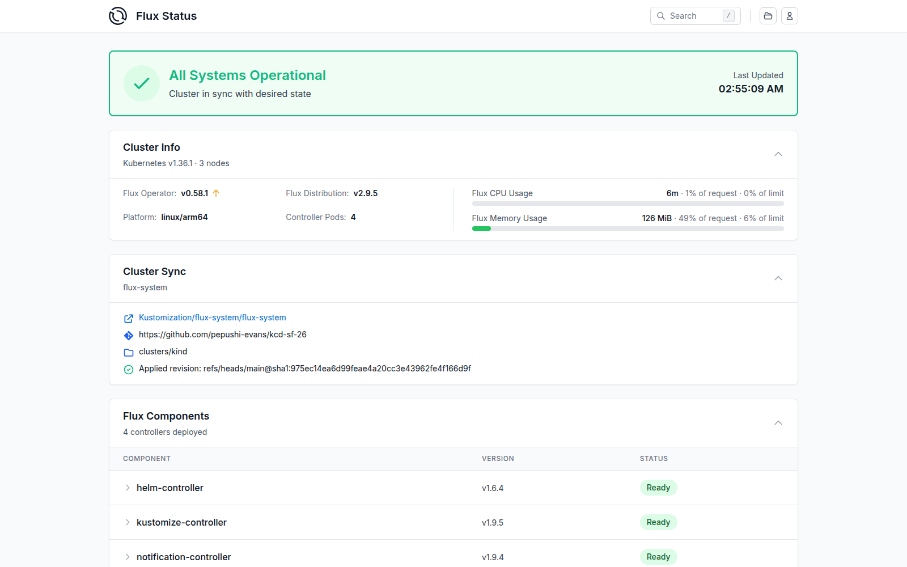
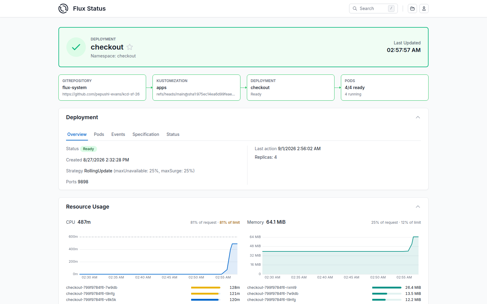

# Demo backup slides

Prerecorded outputs of the live demo, one slide per beat.
Present standalone with `npx slidev demo-backup/backup-slides.md`,
or lift images/blocks into the main deck.

---

## 1 — Baseline: everything arrived via Git

```
NAME         REVISION              SUSPENDED  READY  MESSAGE
agents       main@sha1:975ec14e    False      True   Applied revision: main@sha1:975ec14e
apps         main@sha1:975ec14e    False      True   Applied revision: main@sha1:975ec14e
flux-system  main@sha1:975ec14e    False      True   Applied revision: main@sha1:975ec14e
```



---

## 2 — The incident: HPA saturated at its ceiling

```
NAME       REFERENCE             TARGETS        MINPODS   MAXPODS   REPLICAS
checkout   Deployment/checkout   cpu: 85%/60%   2         4         4

AbleToScale=True (ReadyForNewScale)
ScalingActive=True (ValidMetricFound)
ScalingLimited=True (TooManyReplicas)      <- capped by maxReplicas

checkout-799f9784f6-7w9db   138m    (limit: 150m)
checkout-799f9784f6-rxml9   102m
checkout-799f9784f6-t9nfg   148m
checkout-799f9784f6-v8k5k   124m
```

---

## 2b — The same incident in the Flux UI



---

## 3 — The guardrails, proven live

```
$ kubectl auth can-i patch hpa -n checkout \
    --as=system:serviceaccount:agents:capacity-agent
no

$ nono run --profile nono-profile.json -- \
    curl https://api.github.com/repos/pepushi-evans/kcd-sf-26     # own repo
HTTP 200

$ ... curl https://api.github.com/repos/torvalds/linux    # anyone else's
{"error":"Forbidden"}          <- the sandbox proxy; never reached GitHub

$ ... curl https://example.com                            # the internet
(blocked: host not in allowlist)
```

---

## 4 — The agent engages (sandboxed, in-cluster)

```
[capacity-agent] hpa checkout/checkout: 4/4 replicas, cpu 86% (target 60%)
[capacity-agent] HPA saturated at maxReplicas — engaging
[capacity-agent] tool call: get_hpa_status({})
[capacity-agent] tool call: list_open_capacity_prs({})
[capacity-agent] tool call: get_workload_resources({})
[capacity-agent] tool call: get_cluster_capacity({})
[capacity-agent] tool call: get_hpa_manifest({})
[capacity-agent] tool call: get_kubernetes_resources({'kind': 'Kustomization',
                    'apiVersion': 'kustomize.toolkit.fluxcd.io/v1'})   <- Flux MCP
[capacity-agent] tool call: open_capacity_pr({'title':
                    'checkout: raise HPA maxReplicas 4 -> 8', ...})
                    (flux-schema validates the manifest before the PR opens)
[capacity-agent] final: ### Investigation & Capacity Analysis Summary
```

---

## 5 — The PR: a one-line diff with the math shown

From `pr-2-agent-body.md` (agent-authored, verbatim):

- Observed state table: 4/4 replicas, 86% vs 60% target, `ScalingLimited`
- Demand estimate: ceil(4 x 86/60) + headroom
- Node capacity: additional replicas need 450m « 13,150m free (50% budget)
- **GitOps Context: Managed by Flux Kustomization `flux-system/apps`
  (path `./apps`)** — from the Flux MCP server
- Expected outcome + rollback: `git revert <merge-commit>`

---

## 6 — Merge → Flux reconciles → incident resolves

```
NAME       REFERENCE             TARGETS        MINPODS   MAXPODS   REPLICAS
checkout   Deployment/checkout   cpu: 75%/60%   2         7         7
```

The ceiling rose, the fleet scaled out, utilization falls to target.

And the rollback story is one command:

```
$ git revert bebdd4b && git push
# Flux reconciles: maxReplicas back to 4. The undo is also a commit.
```
